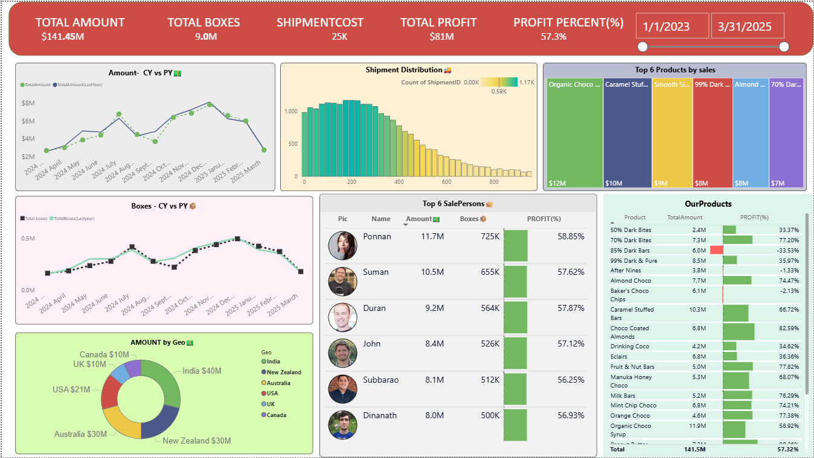

# ECOMMERCE SALE ANALYSIS USING POWERBI

## Project Overview
This project analyzes chocolate sales and shipment performance using Power BI to identify revenue trends, shipment efficiency, product performance, and salesperson contribution. The dashboard provides interactive business insights to support data-driven sales and operational decision-making.

---

## Business Problem
The company required a centralized analytics dashboard to monitor sales performance, track shipment costs, evaluate profitability, and identify top-performing products and salespersons across different geographies.

---

## Objectives
- Analyze revenue and profit trends
- Track shipment performance and operational costs
- Identify top-performing products and salespersons
- Compare current year vs previous year performance
- Evaluate regional sales contribution
- Generate actionable business insights

---

## Tools & Technologies Used
- Power BI
- Power Query
- DAX
- Data Modeling
- Interactive Dashboards

---

## Data Modeling
The project includes a relational data model connecting multiple business tables using Power BI Model View.

### Tables Used
- Shipments Table
- Salesperson Table
- Geography Table

Relationships were created between these tables to enable accurate KPI calculations, filtering, and cross-functional business analysis.

---

## KPIs Tracked
- Total Revenue Generated
- Total Profit
- Profit Margin
- Total Shipment Cost
- Total Boxes Shipped

---

## Dashboard Features
- Revenue comparison (Current Year vs Previous Year)
- Boxes shipped comparison (Current Year vs Previous Year)
- Top 6 Salespersons by Sales
- Top 6 Products by Revenue
- Revenue generated by Geography
- Shipment and profitability analysis
- Interactive filters and drill-down analysis

---

## Key Insights

### Revenue Analysis
- Revenue showed strong year-over-year growth, indicating increasing product demand and improved sales performance.
- Certain products contributed significantly higher revenue compared to others, highlighting strong-performing product categories.

### Profitability Analysis
- Profit margins varied across geographies and products, indicating differences in operational efficiency and shipment costs.
- Increased shipment expenses impacted overall profitability in some regions.

### Salesperson Performance
- Top-performing salespersons contributed a major share of total sales revenue.
- Sales performance distribution revealed opportunities for improving lower-performing sales regions.

### Geography Analysis
- Some geographies generated consistently higher revenue, indicating stronger market demand and customer concentration.
- Regional sales trends highlighted potential expansion opportunities in high-performing markets.

### Shipment Analysis
- Shipment volume increased alongside sales growth, demonstrating rising customer demand and operational activity.
- Higher shipment costs in certain regions affected overall margin performance.

---

## Business Recommendations
- Optimize shipment and logistics costs in low-margin regions.
- Focus marketing and inventory efforts on high-performing products.
- Replicate successful sales strategies from top-performing salespersons.
- Improve operational efficiency in regions with high shipment expenses.
- Expand sales efforts in geographies showing strong revenue growth.

---

## Dashboard Preview

---

## Conclusion
This Power BI dashboard provides a comprehensive view of chocolate sales, shipment performance, profitability, and regional contribution through interactive visual analytics. The project supports business decision-making by transforming raw operational data into actionable insights.
